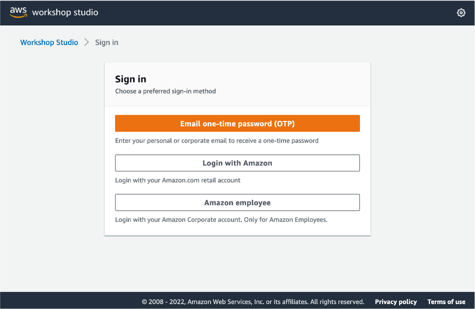
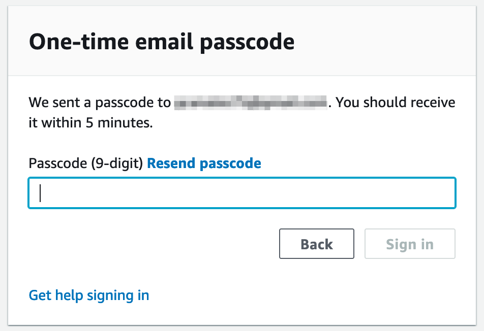
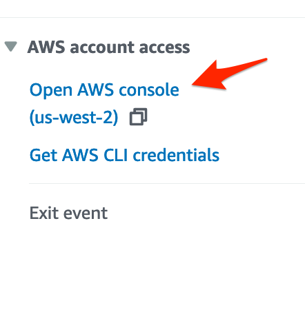
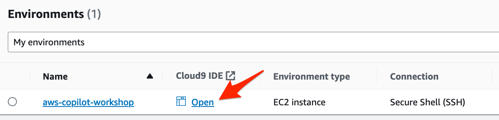
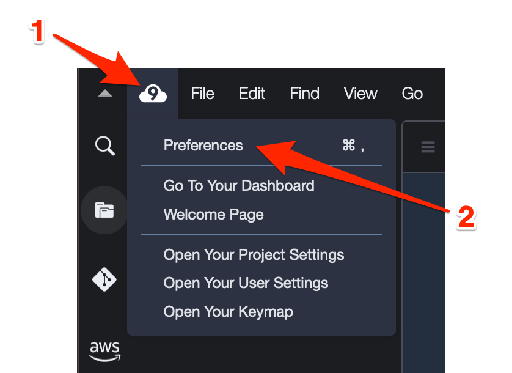
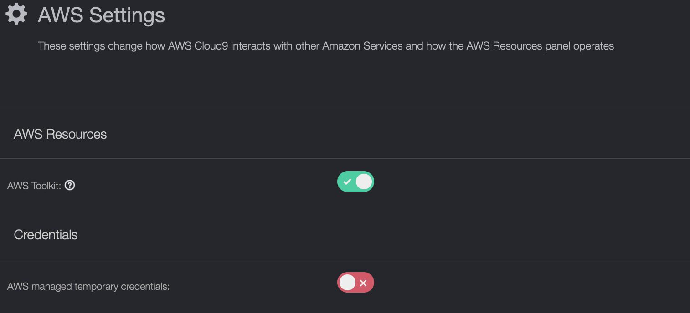

+++ 
title = "Empezar con este taller" 
chapter = true 
weight = 15 
+++

Para participar en el taller donde recibirá acceso a una cuenta de AWS aprovisionada y deberá iniciar sesión en el Workshop Studio. La URL de acceso al evento le será proporcionada por sus anfitriones.

1. Conéctese al portal de Workshop Studio. Luego, elija **Email one-time password** (OTP).

	

1. Ingrese su correo electrónico en la página siguiente y continúe.

1. Verifique el correo electrónico para obtener el código de acceso (puede tardar hasta 5 minutos en recibirlo). Ingresa el código de acceso en el cuadro de texto y elige Iniciar sesión.

	

1. Revisar los términos y condiciones. Una vez revisado, marca la casilla para confirmar las reglas del taller y seleccione **Join event**.

1. Esto te llevará a la página principal del evento. Seleccione **Get started** para iniciar el taller.

1. Después de pasar por **Get Started**, serás redirigido a las instrucciones del taller. Allí encontrará todos los materiales, documentación de respaldo y acceso a la cuenta de AWS.

1. Para acceder a la cuenta de AWS que utilizará para este taller, vaya al menú del lado izquierdo y seleccione Abrir consola de AWS. Esto abrirá la consola de administración de AWS en una nueva pestaña.

	

1. Para hacer el taller principalmente se utilizará **Cloud9**. Escriba **Cloud9** en la barra de búsqueda y seleccione el servicio.

1. En la columna IDE de Cloud9, seleccione **Open**.

	

1. Una vez que su IDE de **Cloud9** esté listo, tendrá la carpeta del taller que contiene todo el código fuente y terminal para ejecutar todas las actividades de este taller.

1. Es muy importante antes de comenzar a trabajar en el laboratorio, deshabilitar las credenciales temporales administradas por AWS. Seleccione el logotipo de 'AWS Cloud9' en la barra de menús y, a continuación, seleccione 'Preferences'.

	

1. Luego, desplácese hacia abajo hasta que encuentre **AWS Settings** y, en Credenciales, desactive las credenciales temporales administradas por AWS. Debe de verse así la configuración:

	

1. Cierre las pestañas de **Welcome**, **Preferences** y la terminal que se encuentra en panel inferior de la pantalla.

1. De la barra de menu de opciones superior, seleccione **Window** -> **New terminal**

¡Bienvenido!