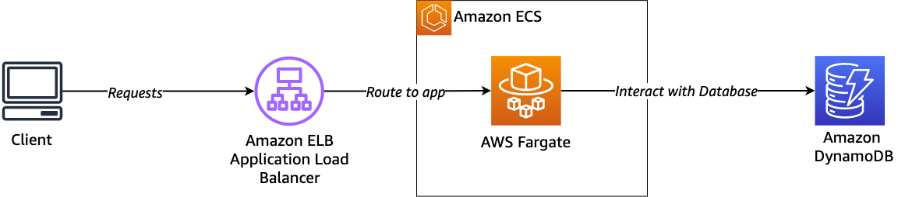

+++ 
title = "Modulo 1 - Desplegar la API" 
chapter = true 
weight = 20
+++

En este primer módulo, vamos a implementar una API en Amazon ECS y ejecutándose en AWS Fargate. La API se integrará con Amazon DynamoDB para almacenar toda la información requerida. Vamos a usar un balanceador de carga de aplicaciones (ALB). El endpoint para ALB proporcionará acceso público para que cualquier cliente pueda acceder a la API.

Vamos a construir una API para convertir una entrada de Markdown en HTML y almacenar las solicitudes en una base de datos.

*Diagrama:*



**Overview del laboratorio**

Esta sección le dará una breve información sobre los códigos de aplicación y también el entorno de aplicación requerido.

*Codigo de la aplicación*

El archivo principal para el `svc-api-markdown` es `app.py` y está escrito en Python usando el framework Flask. Hay 2 rutas disponibles en esta API:

  1. Método **GET** — `/health`: Ruta para healthcheck realizada por ALB

  1. Método **POST** — `/api/markdown/process`: Endpoint para convertir una entrada Markdown en HTML

*Flujo de solicitudes de la aplicación*

El flujo de solicitud se inicia cuando la llamada va a al endpoint `/api/markdown/process` con método `POST`. Esta aplicación acepta el  `JSON` como payload y texto como el nombre de entrada de la variable.

Si la aplicación recibe JSON como payload, asumirá que la entrada está en formato `Markdown` y se convertirá en salida `HTML`. Una vez que haya convertido con éxito la entrada, guardará los datos en DynamoDB a través de la función `save_data`. Si la respuesta de la función `save_data` devuelve `True`, devolverá el resultado junto con el código `HTTP 200`. De lo contrario, devolverá error con el código `HTTP 500`.

El siguiente código define el flujo:

```
@app.route('/api/markdown/process', methods=['POST'])
def to_markdown():
    response_data = {}
    response_status = 500    
    try:
        logging.info("Received request: {}".format(request.json))
        if "text" not in request.json:
            response_data = {"error":"No accepted parameters"}
            response_status = 400
            return jsonify(response_data), response_status

        if "text" in request.json:
            input_markdown = request.json['text']
            html = markdown.markdown(input_markdown)
            db_status = save_data(input_markdown, html)
            if db_status:
                response_data = {"markdown": input_markdown, "html": html}
                response_status = 200
            else:                
                response_data = {"error": "Unable to save data to database"}
                response_status = 500
            return jsonify(response_data), response_status
    except Exception as e:
        logging.error("Error on handling request {}".format(e), exc_info=True)
        return jsonify(response_data), response_status
```

Esta aplicación tiene la función `save_data` para guardar la entrada en la base de datos. La función simplemente usa la API `update_item` para guardar la entrada Markdown y la salida HTML en **DynamoDB** con información adicional de marca de tiempo.

```
def save_data(markdown, html):
    try:
        table = dynamodb.Table(
            os.getenv("<CHANGE_THIS_TO_YOUR_DATABASE_NAME>")
            )
        id = str(uuid.uuid4())
        table.update_item(
            Key={'ID': id},
            UpdateExpression="set message_markdown=:markdown, message_html=:html, request_date=:sts",
            ExpressionAttributeValues={
                ':markdown': markdown,
                ':html': html,
                ':sts': datetime.now().strftime("%m-%d-%Y %H:%M:%S")
            })
        return True
    except Exception:
        logging.exception("Error on saving data into DynamoDB", exc_info=True)
        return False
```

**Función de healthcheck**

En `app.py`, también encontrarás la función de healthcheck. Podría ser una función simple, sin embargo, sin esta función, el  balancedor de carga (ALB) no entenderá si su aplicación está funcionando o no. Si no acepta la respuesta de `healtcheck` adecuada de su solicitud, asumirá que su solicitud no puede ser aceptada.

  ```
  @app.route('/health', methods=['GET'])
  def healthcheck():
      data = {"status": "ok"}
      return jsonify(data), 200
  ```

## Instrucciones:

Necesitarás trabajar en la directorio titulada `work-folder`, este será tu directorio de trabajo durante el taller. Además es necesario que copies el contenido de `source/mod1-deploy-api` en el directorio de `work-folder`.

```
cd workshop/work-folder/
cp -rf ../source/mod1-deploy-api/svc-api-markdown .
```

```
work-folder/ # Este será su directorio de trabajo
└──svc-api-markdown/
    ├── app.py
    ├── Dockerfile
    └── requirements.txt
```

**Paso 1: Inicializar la aplicación**

Cuando utiliza **AWS Copilot**, el primer paso que debe hacer es inicializar su aplicación usando el comando `copilot init`. Se puede ingresar al modo interactivo simplemente ejecutando `copilot init`, pero en este módulo, usaremos flags para consistencia.

Desde tu terminal y en el directorio de trabajo, ejecuta el siguiente comando:

```
copilot init --app module1 --dockerfile svc-api-markdown/Dockerfile --name svc-api-markdown --type  "Load Balanced Web Service"
```

Cuando Copilot solicite implementar en un entorno de prueba, elija **N**. Configuraremos un entorno de aplicación en el siguiente paso.

```
Would you like to deploy a test environment? [? for help] (y/N)
```

Este comando crea una nueva aplicación y almacena el manifiesto para svc-api-markdown en la siguiente ruta `copilot/svc-api-markdown/manifest.yml`. En la siguiente sección, cubriremos cómo personalizar el manifiesto.

**Paso 2: Configurar ruta y healthcheck**

Cuando creas un servicio en tu aplicación, ciertamente necesitas definir la ruta por la que deben pasar las solicitudes. Por ejemplo, probablemente quieras enrutar todas las solicitudes API a api/ —manejadas por el servicio API— y abrir la página web a web/ — manejada por el servicio web.

Copilot le brinda flexibilidad para configurar la ruta que se adapte a sus necesidades. Como el **ALB** para servicios web balanceados de carga es un recurso compartido, puede ajustar la ruta a un servicio específico. También es necesario configurar la ruta de healthcheck para su aplicación.

Para configurar la aplicación HTTP y las rutas de healthcheck, haga lo siguiente:

  1. Abra dando doble-click en el archivo de manifiesto ubicado en `work-folder/copilot/svc-api-markdown/manifest.yml`

  1. Encuentra la sección que comienza con http.

```
# Distribute traffic to your service.
http:
  # Requests to this path will be forwarded to your service.
  # To match all requests you can use the "/" path.
  path: '/'
  # You can specify a custom health check path. The default is "/".
  # healthcheck: '/'
```

Cambiar la configuración como se muestra a continuación y guardar los cambios.

```
# Distribute traffic to your service.
http:
  path: 'api/markdown'
  healthcheck: '/health'
```

Esta configuración asegura que las solicitudes vayan a `/api/markdown` para su `svc-api-markdown` y el **ALB** verificará el estado de su aplicación haciendo llamadas a `/health`.

**Paso 3: Inicializar el entorno**

En esta etapa, has inicializado tu servicio como una nueva aplicación. Sin embargo, aún no tienes ningún entorno para tu servicio.

El siguiente paso que necesitas es configurar un entorno llamado `staging`. Ejecute el siguiente comando para crear un ambiente:

```
copilot env init --name staging --default-config --profile default
```

Pausa para café. Esto te llevará alrededor de 1-2 minutos.

El comando anterior creará un entorno llamado staging con el perfil nombrado predeterminado en su configuración de credenciales de AWS. Copilot creará el archivo de manifiesto para su ambiente `staging` en la siguiente ruta: `copilot/environments/staging/manifest.yml`. Similar a otros manifiestos, también puedes personalizar el manifiesto en función de tus necesidades.

Con el indicador predeterminado `--profile`, estás configurando una nueva VPC y Multi-AZ, cada una de ellas tiene una subred pública y privada. También puede usar la VPC existente usando el indicador `--import-vpc-id`, sin embargo, crear con `--default-config` es una práctica recomendada.

El siguiente paso es implementar el entorno usando el siguiente comando:

```
copilot env deploy --name staging
```

☕️ Pausa para café. Esto te llevará alrededor de 5 minutos.

**Paso 4: Integrar con la base de datos**

Esta aplicación requiere una integración con una base de datos para funcionar correctamente. En este paso, configurará **DynamoDB** y modificará el código de la aplicación.

Para crear un recurso DynamoDB con Copilot, ejecute el siguiente comando:

```
copilot storage init -t DynamoDB -n markdown-table --partition-key ID:S --no-lsi --no-sort -w svc-api-markdown
```

El prompt le preguntará:

`Do you want the storage to be created and deleted with the svc-api-markdown service?`

Seleccione la opción de default:

`Yes, the storage should be created and deleted at the same time as svc-api-markdown`.


Este comando creará un archivo de manifiesto para una tabla de DynamoDB llamada `markdown-table` con `ID` como clave de partición de tipo `string`, sin localSecondaryIndex y Sort Key adjuntas a `svc-api-markdown`. El archivo de manifiesto se puede encontrar en `copilot/svc-api-markdown/addons/markdown-table.yml`.

**Paso 5: Modificar códigos de aplicación**

Una vez que ejecute el comando, recibirá una salida como se muestra a continuación:

```
Update svc-api-markdown code to leverage the injected environment variable MARKDOWNTABLE_NAME.
```

El siguiente paso es modificar nuestro código de aplicación para utilizar la variable de entorno.

Abra `work-folder/svc-api-markdown/app.py` y cambie la línea `39` (solo requiere modificar `<CHANGE_THIS_TO_YOUR_DATABASE_NAME>` por `MARKDOWNTABLE_NAME`):

```
table = dynamodb.Table(os.getenv("<CHANGE_THIS_TO_YOUR_DATABASE_NAME>"))
```

a: 

```
table = dynamodb.Table(os.getenv("MARKDOWNTABLE_NAME"))
```

Guarde cambios.

**Paso 6: ¡Despliegue!**

El siguiente paso es implementar la aplicación. Ejecute el siguiente comando para implementar tu primera aplicación:

```
copilot svc deploy --name svc-api-markdown --env staging
```

☕️ Pausa para el Café
Esto te llevará alrededor de 3-8 minutos.

¡Acaba de implementar su primera aplicación con AWS Copilot!

**Paso 7: Probar la aplicación**

Para probar tu aplicación, puedes obtener la URL de tu API ejecutando:

```
copilot svc show --name svc-api-markdown
```

Obtener la URL en la sección `Route` de la salida:

```
Routes

  Environment  URL
  -----------  ---
  staging      http://APP.ap-southeast-1.elb.amazonaws.com/api/markdown

```

Ahora, antes de probar su aplicación, debe recordar que hemos definido `/api/markdown` para su ruta de servicio, y para procesar la conversión de Markdown, necesita usar la ruta de proceso. Todo lo que necesitamos es formar la URL correcta: `http://<URL>/api/markdown/process`.

Puedes probar la URL usando curl:

```
curl -X POST <staging_URL>/process -d '{"text":"# Hello world from AWS Copilot!"}' --header "Content-type: application/json"
```

Si todo funciona, verá el siguiente resultado:

```
{
  "html": "<h1>Hello World from AWS Copilot</h1>",
  "markdown": "# Hello World from AWS Copilot"
}
```

También puede verificar desde la consola de DynamoDB si se ha creado el registro. Debe ir a la consola de Amazon DynamoDB y encontrar la tabla. Si sigues los pasos, tendrás una tabla denominada module1-staging-svc-api-markdown-markdown-table.

**Paso 8: Monitoreo de los logs de la aplicación**

Una vez que tengas tu aplicación implementada, también puedes ejecutar algunos comandos adicionales que son útiles si estás haciendo monitoreo.

Para ver el estado general de la aplicación

```
copilot app show
```

Para visualizar los logs:

```
copilot svc logs --name svc-api-markdown --env staging
```

`watch` de los logs

```
copilot svc logs --name svc-api-markdown --env staging --follow
```

**Lo que hemos aprendido**

  - Usa copilot `init` para comenzar a inicializar tus aplicaciones
  - Todos los manifiestos de IaC se almacenan en la carpeta `./copilot/`
  - Utilice el almacenamiento de copiloto para conectar el bucket de **Amazon S3**, **Amazon DynamoDB** y **Amazon Aurora**
  - Un recurso de respaldo solo está destinado a un servicio. Conéctese a través de APIs para microservicios
  - Usar `copilot deploy` para implementar aplicaciones
  - Usar `copilot status` para verificar el estado general
  - Usa `copilot svc show` para obtener información detallada
  - Usa `copilot svc logs` (con `--follow`) para obtener todos los logs de tus aplicaciones

---