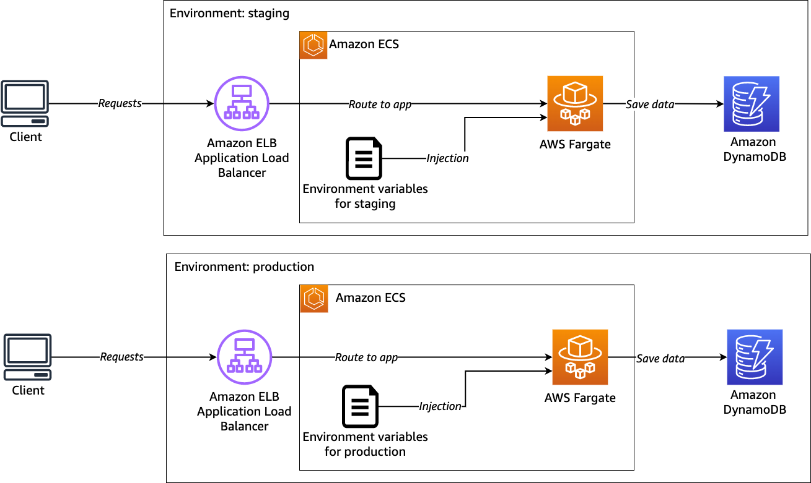

+++ 
title = "Modulo 2 - Configurar múltiples ambientes" 
chapter = true 
weight = 30 
+++

En el módulo anterior, hemos creado un entorno llamado *staging*. En este módulo aprenderemos a construir otro entorno llamado *production*.

Esto se considera una práctica recomendada ya que su aplicación se ejecuta en un entorno aislado, lo que le brinda flexibilidad para mantener diferentes lanzamientos, es decir, trabajar en nuevas funciones sin afectar el ambiente productivo. Con **AWS Copilot**, también tendrá un beneficio en la paridad dev/prod, lo que simplemente significa minimizar la diferencia entre los entornos y hacerlos lo más similares posible.

*Diagrama:*



**Paso 0: Ir al directorio de trabajo**

Para evitar cualquier problema en la localización de la ruta de los archivos, se recomienda ejecutar comandos de Copilot desde la carpeta raíz de su proyecto, en este caso es work-folder.

Para asegurarte de que estás en el camino correcto, puedes ejecutar el comando `pwd`.

```
pwd
```

Te mostrará la siguiente salida:

```
/home/ec2-user/environment/workshop/work-folder
```

El ejemplo anterior es la ruta si está ejecutando en cuentas proporcionadas por AWS (usando **AWS Cloud9**). Puede ser diferente dependiendo de cómo estructures tu carpeta de trabajo.

**Paso 1: Inicializar entorno adicional**

Para inicializar un nuevo entorno para tu aplicación, puedes usar copilot `env init`.

El siguiente paso que necesitas es configurar un entorno llamado *production*. Ejecute el siguiente comando para crear un entorno para tu `svc-api`:

```
copilot env init --name production --default-config --profile default
```

Lo mismo con la inicialización del entorno en el módulo anterior, el comando anterior creará un entorno llamado `production` con el perfil nombrado predeterminado en su configuración de credenciales de **AWS**. **Copilot** creará el archivo de manifiesto para su entorno de producción en la siguiente ruta: `copilot/environments/production/manifest.yml`.

El siguiente paso es implementar el entorno usando el siguiente comando:

```
copilot env deploy --name production
```

Una vez hecho esto, puedes verificar la lista de tus entornos ejecutando el siguiente comando:

```
copilot env show
```

Te mostrará la siguiente salida:

```
  Which environment of module1 would you like to show?  [Use arrows to move, type to filter, ? for more help]
  > production
    staging
```

En este caso, se puede seleccionar `production` y ésta proporcionará salida con los siguientes resultados:

```
Environment: production
About

  Name        production
  Region      us-west-2
  Account ID  XYZ

Workloads

  Name    Type
  ----    ----

Tags

  Key                  Value
  ---                  -----
  copilot-application  module1
  copilot-environment  production
```

**Paso 2: Deploy del servicio para el ambiente productivo**

Una vez que haya creado otro ambiente, **AWS Copilot** no implementa automáticamente su servicio. Para implementar la aplicación en el ambiente de producción, necesita levantar el servicio ejecutando el siguiente comando:

```
copilot svc deploy --name svc-api-markdown --env production
```

☕️ Pausa para el café. Esto te llevará alrededor de 3-8 minutos.

De esta manera, nos aseguramos de que el `svc-api-markdown` se despliegue junto con una nueva tabla de **DynamoDB** en su ambiente de producción.

**Lo que hemos aprendido**

- Inicializar un entorno adicional con copilot env
- La construcción de canalización con pipeline de Copilot se basará en cómo configure el orden de su (s) entorno (s)
- Información detallada disponible para cada entorno ejecutando copilot svc show