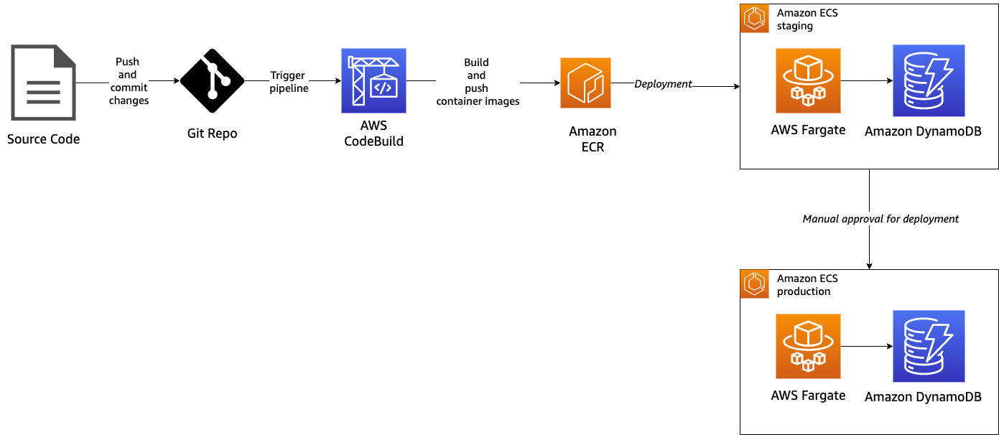
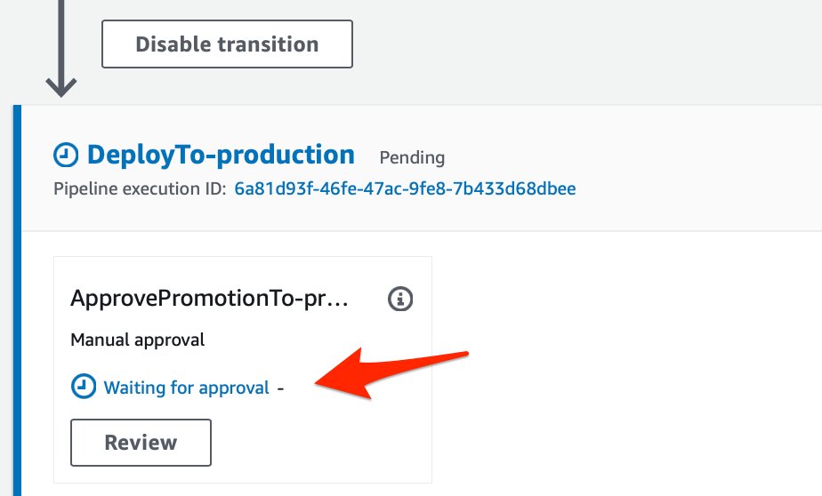
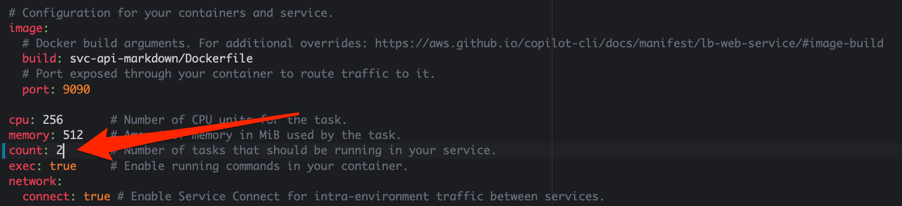

+++ 
title = "Modulo 3 - Construir un pipeline de CI/CD" 
chapter = true 
weight = 40 
+++

En este laboratorio, vamos a implementar CI/CD para nuestra aplicación. Vamos a utilizar **AWS CodeCommit** como repositorio Git, **AWS CodePipeline** como un servicio de entrega continua completamente administrado para automatizar la canalización y **AWS CodeBuild** para compilar código fuente, ejecuta pruebas y producir artefactos.

> ℹ️ La integración continua (CI) es un proceso en el que los desarrolladores regularmente insertan su código en un repositorio de código centralizado y desencadena más operaciones, como pruebas y procesos de construcción de artefactos.

> ℹ️ La entrega continua (CD) es un proceso en el que los artefactos se implementan en el entorno de prueba, el entorno de ensayo y el entorno de producción.

**AWS Copilot** define el pipeline de la siguiente manera:

**Fase fuente (source)**. Esta etapa se activa cada vez que empujamos al repositorio de Git.

**Fase de construcción (build)**. En esta etapa, el proceso es construir la imagen del contenedor y empujar al repositorio de imágenes de Amazon ECR.

**Fase de Despliegue (deploy)**. Después de construir todos los artefactos, esta etapa despliega la aplicación en cualquiera de los ambientes configurados.

En esta etapa del taller, tienes 2 entornos en tu aplicación, *staging* y *producción*. Vamos a implementar despliegue continuo (CD).

Con despliegue continuo, el proceso de compilación comienza cuando se ocurre una actualización en el código del repositorio *Git* y activará la canalización de código de AWS. Una vez que haya construido con éxito el artefacto, se desplegará en el ambiente de staging. Luego, el proceso se detuvo ya que necesitamos hacer la aprobación manual antes de que la aplicación entre en el ambiente de producción.

*Diagrama:*



⚠️ **(Importante)**

Necesitas trabajar en el directorio `work-folder`.

**Paso 0: Crear y configurar el repositorio Git con AWS CodeCommit**

```
# Create AWS CodeCommit repo
aws codecommit create-repository --repository-name copilotRepo --repository-description "copilot repo"
# Initialize git
git init
# Add remote
git remote add origin https://git-codecommit.us-west-2.amazonaws.com/v1/repos/copilotRepo
# Checkout remote main branch
git checkout -b main
```

**Paso 1: Configuración del pipeline**

Una vez que tengas tu repositorio *Git*, el siguiente paso es configurar la canalización. Para configurar el pipeline con Copilot, puede usar el comando copilot pipeline init. Ejecute el siguiente comando en tu terminal:

```sh
copilot pipeline init --name module1 --url https://git-codecommit.us-west-2.amazonaws.com/v1/repos/copilotRepo --git-branch main --environments staging,production --pipeline-type Workloads
```

Tendrás una salida similar a la siguiente:

```
✔ Wrote the pipeline manifest for demo-copilot-pipeline at 'copilot/pipelines/module1/manifest.yml'
The manifest contains configurations for your pipeline.
Update the file to add stages, change the tracked branch, add test commands or manual approval actions.
✔ Wrote the buildspec for the pipeline's build stage at 'copilot/pipelines/module1/buildspec.yml'
The buildspec contains the commands to push your container images, and generate CloudFormation templates.
Update the "build" phase to unit test your services before pushing the images.
```

**Paso 2: Revisar manifiestos**

Una vez que hayas inicializado la canalización, el siguiente paso es que necesites revisar el archivo de manifiesto.

Abre `copilot/pipelines/module1/manifest.yml` y encontrarás la sección de *stages*.

```
stages:
  - # The name of the environment.
    name: staging
    # Optional: flag for manual approval action before deployment.
    # requires_approval: true
    # Optional: use test commands to validate this stage of your build.
    # test_commands: [echo 'running tests', make test]

  - # The name of the environment.
    name: production
    # Optional: flag for manual approval action before deployment.
    # requires_approval: true
    # Optional: use test commands to validate this stage of your build.
    # test_commands: [echo 'running tests', make test]
```

Esta configuración define el orden del entorno, comenzamos con el despliegue en staging primero, luego continuamos con la producción.

Para implementar la aprobación manual antes de la implementación en el entorno de producción, necesitamos modificar el archivo de manifiesto en el pipeline. En la etapa de producción, *descomentar* `requires_approval` para que tenga el siguiente aspecto:

```
- # The name of the environment.
  name: production
  # Optional: flag for manual approval action before deployment.
  requires_approval: true
  # Optional: use test commands to validate this stage of your build.
  # test_commands: [echo 'running tests', make test]
```

Guarde cambios

**Paso 3: Git commit y push**

Luego, es necesario agregar y hacer push de todos los archivos dentro de la carpeta `copilot/` y `svc-api-markdown/`

```
git add copilot/
git add svc-api-markdown/
git commit -m "Add copilot files"
git push -u origin main
```

**Paso 4: Implementar Pipeline**

El último paso es desplegar la canalización ejecutando el siguiente comando:

```
copilot pipeline deploy
```

El proceso de creación tomará aproximadamente 3-4 minutos.

Deberás observar una salida similar:

```
✔ Successfully created a new pipeline: module1
```

Una vez creado el pipeline, puedes navegar a la consola del servicio de **AWS CodePipeline** para monitorear su avance o ejecutar el siguiente comando:

```
copilot pipeline status
```

Deberá obtener usa salida similar a:

```
Pipeline Status

Stage                                           Transition  Status
-----                                           ----------  ------
Source                                          ENABLED     Succeeded
└── SourceCodeFor-module1                                   Succeeded
Build                                           ENABLED     Succeeded
└── Build                                                   Succeeded
DeployTo-staging                                ENABLED     Succeeded
└── CreateOrUpdate-svc-api-markdown-staging                 Succeeded
DeployTo-production                             ENABLED     InProgress
├── ApprovePromotionTo-production                           Succeeded
└── CreateOrUpdate-svc-api-markdown-production              InProgress
```

Una vez que concluya el deploy en el ambiente de *staging*, podrá observar que hay una acción manual pendiente de ser aprobada:



Seleccione **Review** y luego seleccione **Approve**

Esto iniciará la última fase del pipeline, espera aproximadamente 5 minutos para que concluya el pipeline.

**Paso 5: GitOps**

Ahora hará un cambio en la configuración de la infraestructura por medio de actualizar un archivo de configuración y hacer push al repositorio Git

Actualmente cada ambiente se compone de 1 (un) task por *Servicio*, esto lo puede validar accediendo a la consola del servicio **ECS**, seleccionando cualquiera de los 2 clusters que se encontrará y accediendo a la pestaña de **Tasks**

Ahora modifique el archivo `copilot/svc-api-markdown/manifest.yml` para definir `2` tasks por servicio:



Guarde cambios

Actualice el repositorio de CodeCommit

```
git add copilot/
git add svc-api-markdown/
git commit -m "Update number of tasks"
git push -u origin main
```

Esto iniciará un nuevo pipeline, puedes navegar a la consola del servicio de **AWS CodePipeline** para monitorear el proceso o ejecutar el siguiente comando:

```
copilot pipeline status
```

Recuerde aprobar manualmente la última fase del despliegue en el ambiente de *producción* para liberar la actualización también el el ambiente productivo.

**Lo que hemos aprendido**

- Defina su etiqueta de imagen al crear CI/CD con AWS Copilot
- Agregar informe de compilación y pruebas de integración en cada entorno
- Implementación en múltiples entornos
- El orden de las implementaciones del entorno en función de la configuración en manifiesto
- Implementar la entrega continua mediante la adición de intervención manual antes de la implementación